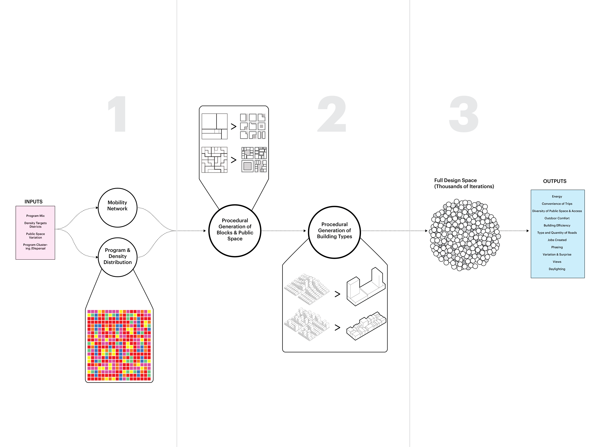
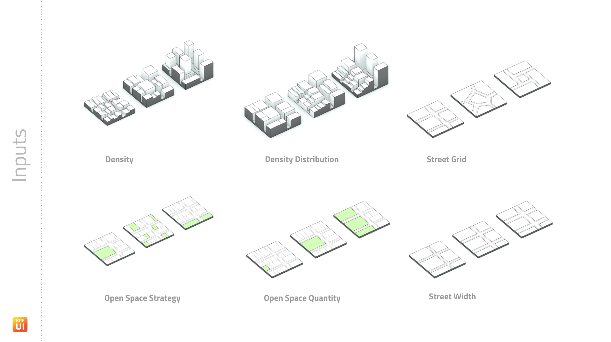
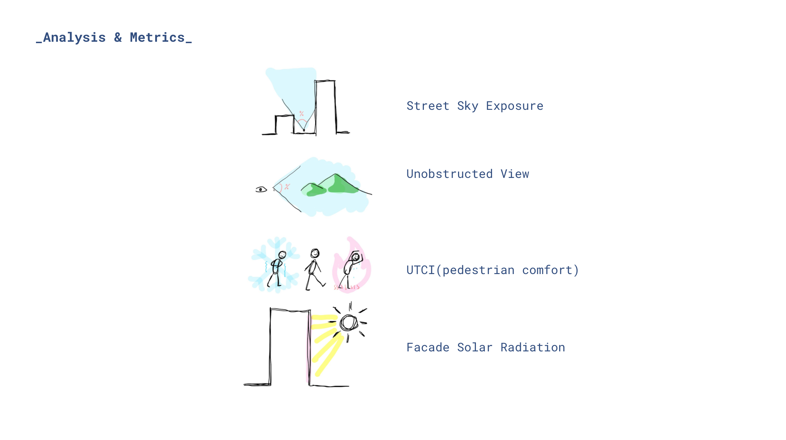
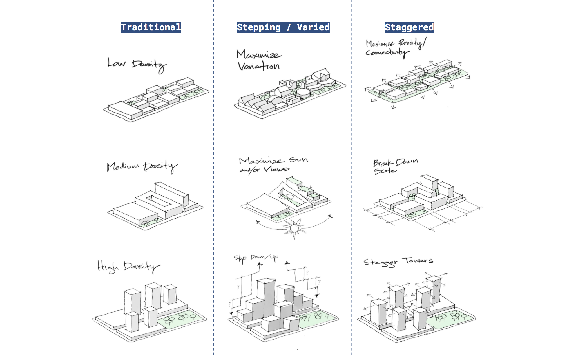
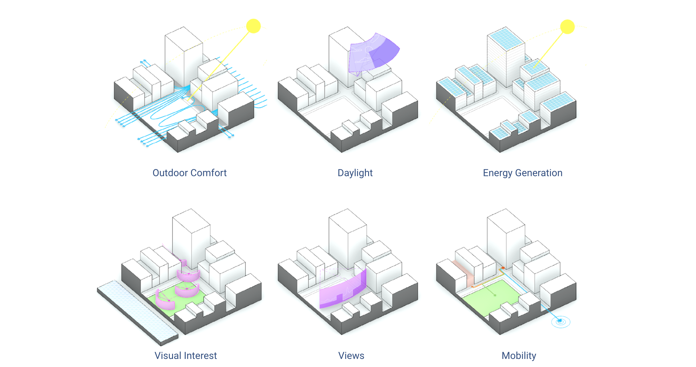

# (Project Title)

### Intro


This image should be an ***introduction image*** that clearly describes your computational design model.
*Please include a short caption.*

### Thesis Statement and Daring Question

This should be a detailed description of your project. This statement should explain central thesis of your computational model. Write -- sentences to explain.

This section will also include the ***daring questions*** that you asked during the development of your computational model.


For example, a daring question would be:

```
“What if all park space was equitably distributed?”
```

Then, you would take a google earth image of Manhattan and photoshop buildings in place of Central Park and many small parks scattered throughout the borough. See image below.


This image should be a ***photo collage*** that is illustrative of the outcome of your project.
*Please include a short caption describing your college.*


### Goals and Metrics

These section should be descriptive of how your team is setting up goals and metrics to determine success.

1. What are you measuring?
1. Why you are measuring it?
1. How it relates to your goals?


### Summary of Conclusions and Takeaways

This section should be a summary get the reader excited about understanding your project by stating the outcome up front. The rest of the project documentation/presentation will be focus on illustrating how you got there.


```
For example,
“Through the computational design model we have identified X and Y trends that allows the city
to address Z while achieving or increasing A and B.”
```

Explain why the outcome of your model is important by highlighting:
1. Background research for your prompt
1. Creating a future context
1. Process of how your team developed custom metrics
1. Urban data mapping
1. Exploration and transformation of NYC into a future condition (if needed)

<br />

## Computational Design Model


This image should be an ***computational design model diagram*** that clearly describes the relationship between your ***inputs, rules and metrics***.
*Please include a short caption.*

### Overview of Model:

Make a clear, easily readable diagram that describes your computational model. Include:
1. Inputs,
1. Procedural types
1. Size
1. Metrics




*Please include a short caption describing your diagram.*

### Analysis Tools:

Describe how you are deriving your metric. Write -- sentences to explain.

1. Have a summary slide/section with each analysis tool.
1. Use a slide/section for each custom tool that requires further explanation on how it works.

[Link](https://github.com/XIM-GSAPP/XIM-GSAPP-Fa20/tree/main/src/tools) to any packaged analysis tools you have documented and posted.


*Please include a short caption describing your diagram.*



*Please include a short caption describing your diagram.*

### Procedural Types

This section focuses on the rules you have defined, range of variability and an explanation of how they relate to you goals and metrics. Write -- sentences to explain.

[Link](https://github.com/XIM-GSAPP/XIM-GSAPP-Fa20/tree/main/src/types) to any procedural types you have documented and posted.


*Please include a short caption describing your diagram.*



It is encouraged to use sketching when illustrating rules and types of your computational design model.
*Please include a short caption describing your diagram.*


### Design Space

This section should be descriptive of your team's input ranges, the reasoning why you picked that range and explanation of what you left out. Write -- sentences to explain.

```
For example,
"I’m varying this input in this range because of X."
```

Please include simple diagram(s) that illustrate extremes of the design space, animated gif of design space and computational model table.



*Please include a short caption describing your diagram.*

<br />

## Analysis and Results

### Scout as a Tool

This section should be descriptive of your team's design exploration, initial insights and trade-offs in relationship to Scout. Write -- sentences to explain.

***Each team will be conducting a live demonstration of your model in Scout when presenting final project.***

Additionally, teams will be required to document their live demo in GitHub with annotated, sequential screenshots replicating the sequence of the live demonstration. Show how you can use Scout to explore scenarios or answer specific questions using the parallel coordinates chart.

```
For example,
“What if’s . . .”
```

### Summarize

This section should be focused on describing specific trends, insights and trade-offs. You can annotate right on top of Scout screenshots or translate insights to diagrams when documenting your process in GitHub.


*Please include a short caption describing your diagram.*

### Conclusions and Next Steps

For the concluding text of your computational design model documentation, think about the following questions as you reinforce the reason why the results your team's model should implemented.

1. How do you recommend the results of your model be used? Who should learn from this?
1. If we are treating this as a proof-of-concept to illustrate the viability of this type of computational approach to the city, what are the next steps for implementation?
1. Your project evaluation relative to the anti-bias rubric we developed. These include identifying limitations, what this does and does not do or include.
