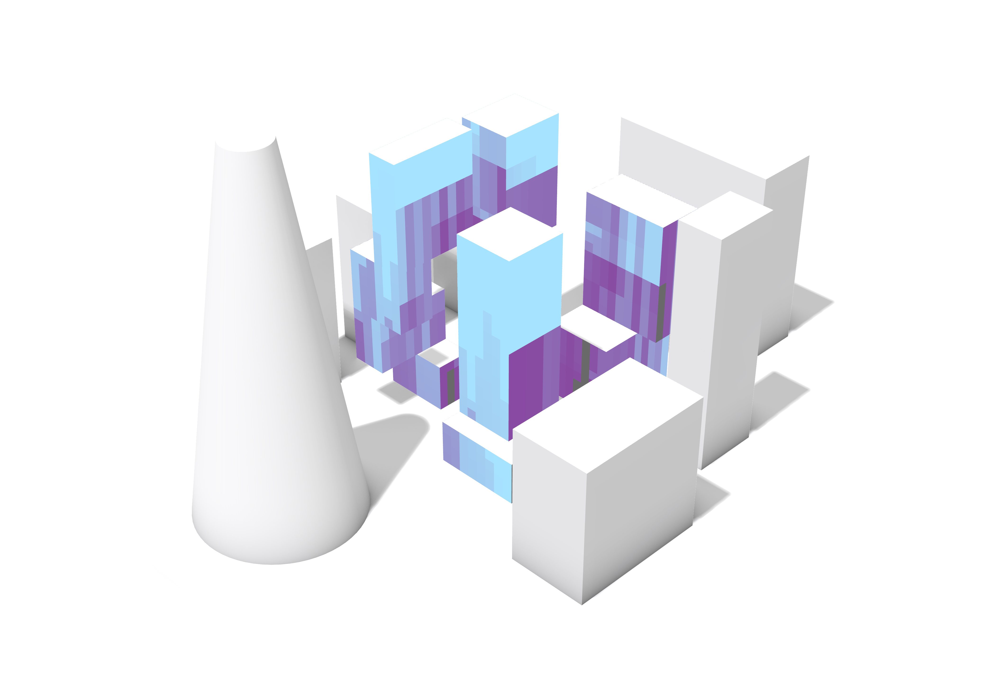

# Visivility Quality Tool
<!--add your title on the first line above-->

<!--add your summary image here, try to make it explanatory of what the tool does, not just what the output looks like. For example, exposure a part of the analysis geometry. An animated GIF can also be used to explain how the tool is working-->

<!--  -->

### Description

<!--add your description below-->
This tool is used to evalutate the **visibility** from a selected set of buildings on the model to the nearest buildings around the entire perimeter of the site. The quality of visibility is display through a color gradient that ranges from violet to gray.

This tool allows designers to easily track which facades of their design have good views to nearby parks, or landmark in a complex urban environment. In **design more** the tool runs in near real time and can be useful to help designers shape massing to target specific views. 

### How To Use

<b>Step by Step Instructions:</b>

1. Link to epw file
2. Right click on "Context" -> Select Multiple and select building obstructions.
3. Right click on "Ground" -> Select Multiple and select ground.
4. Right click on "Ground" -> Select Multiple and select the massing(s) you want to test.
5. Adjust Threshold X,Y,Z
6. Review visual and metric outputs. Does it look correct? Does something look wrong? Common issues below.

<!--  -->

<b> Troubleshooting </b>

Make sure to properly load the context as it is crucial for to test visibility quality

If you don't already have the Visibility Quality Tool, please add to your library for easy usage.

<!--add a list your downloadable links below with "link " appended to the beginning. You should have sample rhino + grasshopper files and a legend-->

! [Analysis Tool Example](../files/Analysis Tool Example.3dm)
link Analysis Tool Example.gh
link grasshopper_tree.jpg
link Analysis Tool Example.ai
(../files/Analysis Tool Example.3dm)

<!--  -->

### Modeling Standards
<!--Revise for specific modeling requirements for you analysis to run properly. If useful, add an image of properly vs improperly model geometry-->
<b>Please follow the following Rhino standards to ensure the proper functionality of the tool:</b>

<input type="checkbox"> <b>My test massing is a single, simplified, CLOSED polysurface.</b>

  <li>Try "SelClosedSrf" to make sure it is closed.</li>

<input type="checkbox"> <b>My model is oriented to True North.</b>

  <li>Re-orient if it was rotated off of North at the start of the project.</li>

<input type="checkbox"> <b>Any groups or blocks in the model have been ungrouped/exploded.</b>

  <li>Try "SelBlockInstance" and "SelGroup" to make sure.</li>

<input type="checkbox"> <b>My model is set to either Meters or Feet (not mm or in).</b>  

<input type="checkbox"> <b>My model is free of overlapping, coplanar, or intersecting geometry.</b> 

<input type="checkbox"> <b>Any obstructions around the space have been modeled (trees, topography, buildings).</b> 

<input type="checkbox"> <b>Any curved surfaces in the model have been simplified to individual flat planes.</b> 

<input type="checkbox"> <b>Any surrounding context has been made into a single, joined mesh.</b>

### Sources, Calculations + Metrics
<!--add text and/or images for any sources for you metrics, calculations & equations, assumptions and specific metric output-->
This tool uses this method of calculating X from this source. The metric is derived in this manner. Lorem ipsum dolor sit amet, consectetur adipiscing elit, sed do eiusmod tempor incididunt ut labore et dolore magna aliqua. Ut enim ad minim veniam, quis nostrud exercitation ullamco laboris nisi ut aliquip ex ea commodo consequat.

### Limitations & Context
<!--add text and/or images that expose potential for bias by stating limitations (ie what does this tool not do,) and the context in which it was created.-->

This tool does X it does not do Z and Y. Lorem ipsum dolor sit amet, consectetur adipiscing elit, sed do eiusmod tempor incididunt ut labore et dolore magna aliqua. Ut enim ad minim veniam, quis nostrud exercitation ullamco laboris nisi ut aliquip ex ea commodo consequat.

### Examples
<!--add images and text to describe a use case below-->
Here is how we used this tool on a project! Lorem ipsum dolor sit amet, consectetur adipiscing elit, sed do eiusmod tempor incididunt ut labore et dolore magna aliqua. Ut enim ad minim veniam, quis nostrud exercitation ullamco laboris nisi ut aliquip ex ea commodo consequat.

Some more text here perhaps.

<b> More project examples here: </b>
